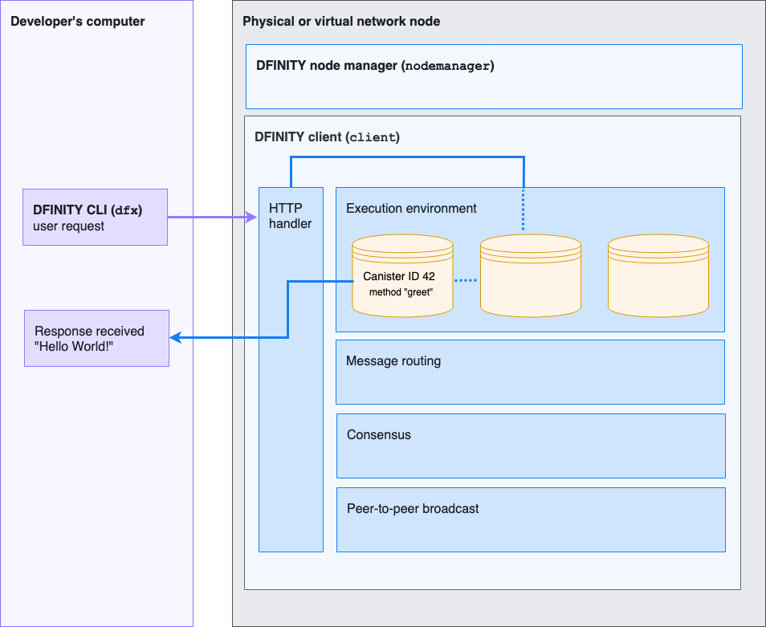

hero: Hello, World! demonstration (v0.1.0)

# Introduction

You are about to embark on a self-guided tour that illustrates:

- How an infrastructure provider can start a node on a Linux computer.

- How an infrastructure provider can stop a node.

- How a user can receive a "Hello World" response by calling a precompiled canister.

This self-guided tour demonstrates the first end-to-end integration of components in different layers and implemented by multiple teams, including the elements of infrastructure, execution environment, HTTP API, and the developer client library. 

The following diagram provides a simplified overview of the request and response workflow and the components involved in processing the request:

