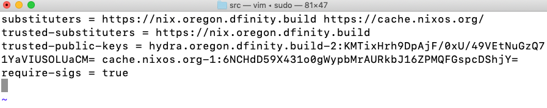

hero: Hello, World! demonstration (v0.1.0)

# Prepare a local environment

If you are not a member of the DFINITY engineering team, you need to start the demonstration by preparing a development environment. If you already have a development environment running, you can skip this section.

To prepare the development environment:

1. Navigate to the [GitHub v0.1.0 release](https://github.com/dfinity-lab/dfinity/releases) and download the **Source code (tar.gz)** or **Source code (zip)** appropriate
for your operating system.

1. Extract the contents of the file you downloaded by double-clicking the
compressed archive or by running the appropriate commands.

    - If you downloaded the **ZIP** file, **double-click** the file in your default <code style="background:transparent">~/Downloads</code> directory.

    - If you downloaded the **TAR.GZ** file, open a terminal in your default <code style="background:transparent">~/Downloads</code> directory, then run the following command:

    <pre style="font-weight:bold;">
    tar -zxvf dfinity-0.1.0.tar
    </pre>

1. Open a terminal shell if you don’t already have one open on your desktop.

1. Change to the <code style="background:transparent">dfinity-0.1.0</code> directory by running the following command in a terminal shell:

    <code style="font-weight:bold;">cd ~/Downloads/dfinityy-0.1.0</code>

1. Download and install Nix using the default single-user installation option by running the following command:

    <code style="font-weight:bold;">curl https://nixos.org/nix/install | sh</code>

    When prompted to provide a password to run <code style="background:transparent">sudo</code>, type your **local administrator account** password.

    When the <code style="background:transparent">nix</code> installation finishes, you are prompted to update your **default profile and PATH environment variable** with output similar to the following:

    <pre style="background:transparent">
    Installation finished!  To ensure that the necessary environment variables are set, either log in again, or type

    . /Users/lisagunn/.nix-profile/etc/profile.d/nix.sh

    in your shell.
    </pre>

    Copy and paste the line displayed to update your profile. You can check whether your current PATH includes <code style="background:transparent">.nix-profile/bin</code> by running the following command:

     <code style="font-weight:bold;">echo $PATH</code>

1. Create a local Nix configuration directory by running the following command:

    <pre style="font-weight:bold;">
    sudo mkdir /etc/nix
    </pre>

1. Create a new Nix configuration file named <code style="background:transparent">/etc/nix/nix.conf</code>.

    For example, run the following command to open <code style="background:transparent">/etc/nix/nix.conf</code> using the <code style="background:transparent">vi</code> text editor:

    <pre style="font-weight:bold;">
    sudo vi /etc/nix/nix.conf
    </pre>

1. Copy and paste the following four lines into the <code style="background:transparent">nix.conf</code> file:

    <pre style="font-weight:bold;">
    substituters = https://nix.oregon.dfinity.build https://cache.nixos.org/
    trusted-substituters = https://nix.oregon.dfinity.build
    trusted-public-keys = hydra.oregon.dfinity.build-2:KMTixHrh9DpAjF/0xU/49VEtNuGzQ71YaVIUSOLUaCM= cache.nixos.org-1:6NCHdD59X431o0gWypbMrAURkbJ16ZPMQFGspcDShjY=
    require-sigs = true
    </pre>

    If you are using the <code style="background:transparent">vi</code> editor, you need to do the following to save your changes to the file:

    - Type <code style="background:transparent">i</code> to insert the copied text.
    
    - Paste the text.
    
    - Press ESC
    
    - Type <code style="background:transparent">:wq</code> to save the changes and close the text editor.
    
    

    For more information about using Nix in the development environment, see [Getting started in dev](https://github.com/dfinity-lab/dev/blob/master/README.md).