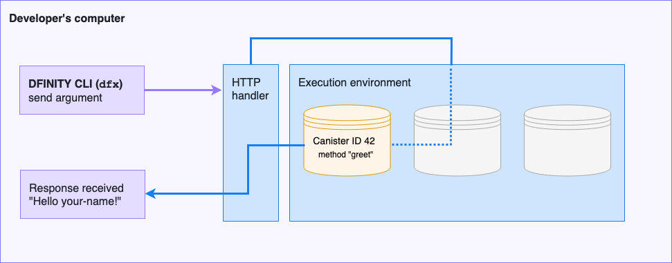

hero: Hello, name! demonstration (v0.2.0)

# Introduction

You are about to embark on a self-guided tour that illustrates:

- How a **developer** can start a node locally on a Linux or macOS computer.
- How a **developer** can compile an ActorScript sample application to create a WebAssembly (`Wasm`) module that can be deployed to the developer network as a **canister**.
- How a **user** can receive a "Hello <name>" response by sending a request that includes an argument to a canister.

This self-guided tour demonstrates the first few critical tasks that a developer needs to be able to accomplish to begin writing applications that can run on the DFINITY network. In this demonstration, the infrastructure and the development environment co-exist on the same computer. 

The following diagram provides a simplified overview of the request and response workflow and the components involved in processing the request:

