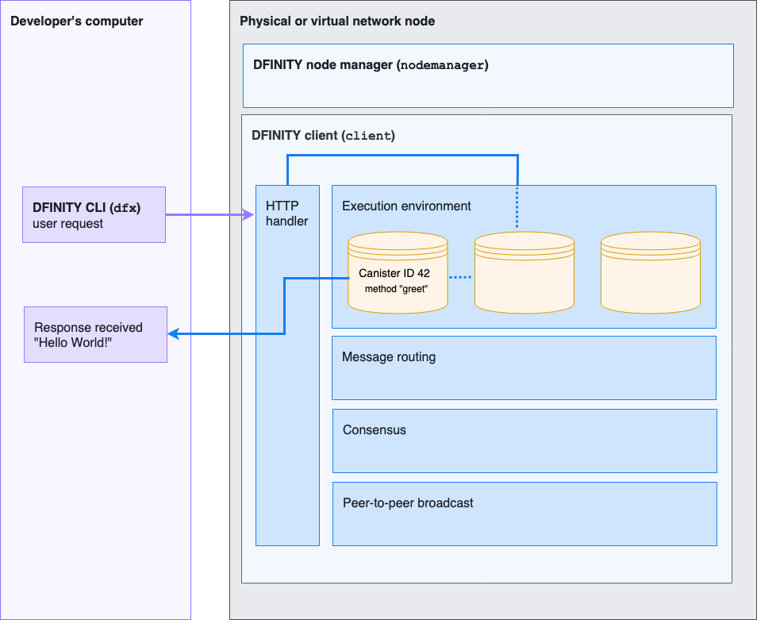

hero: Hello, World! demonstration (v0.1.0)

# Introduction

This self-guided tour demonstrates the first end-to-end integration of components in different layers and implemented by multiple teams, including the elements of infrastructure, execution environment, HTTP API, and the developer client library. 

The following diagram provides a simplified overview of the request and response workflow and the components involved in processing the request:

