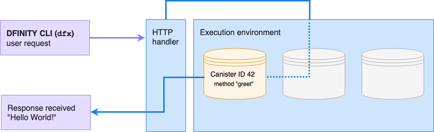

hero: Hello, World! demonstration (v0.1.0)

# Send a request to the preconfigured canister

In this demonstration, there is a pre-compiled Web Assembly application deployed in a preconfigured canister that sends a “Hello World” response to a user request to verify communication over the DFINITY internet computer network using the DFINITY SDK command-line interface (<code style="background:transparent">dfx</code>).

The following diagram illustrates the query request and the response returned from the precompiled canister:

To test sending a request to a precompiled canister:

1. Navigate to the [DFINITY SDK release](https://github.com/dfinity-lab/sdk/releases/tag/0.1.0) directory and download the <code style="background:transparent">dfx</code> executable appropriate for your operating system:

    For **Linux**, download: <code style="background:transparent">dfinity-sdk-0.1.0-x86_64-linux.tar.gz</code>

    For **macOS**, download: <code style="background:transparent">dfinity-sdk-0.1.0-x86_64-macos.tar.gz</code>

1. Extract the contents of the file you downloaded by double-clicking the compressed archive or by running the appropriate commands.

    For example, if you downloaded the file on macOS, you can **double-click** the file in your default <code style="background:transparent">~/Downloads</code> directory or open a terminal in your default <code style="background:transparent">~/Downloads</code> directory, then run the following command:

    <pre style="font-weight:bold;">
    tar -zxvf dfinity-sdk-0.1.0-x86_64-macos.tar
    </pre>

1. Open a terminal shell if you don’t already have one open on your desktop.

1. Move the <code style="background:transparent">dfx</code> executable from your default download location to a directory already in your local path, such as <code style="background:transparent">/usr/bin</code> or <code style="background:transparent">/usr/local/bin</code>.

    For example, if you are using the default Downloads folder on macOS, run the following command:

    <pre style="font-weight:bold;">mv ~/Downloads/dfx /usr/bin/dfx</pre>

1. Run the following command to simulate a user request on the preconfigured canister using the `/api/v1/read` endpoint to return a response:

    <code style="font-weight:bold;">dfx http://localhost:8080</code>

1. Verify the response returned:

    <code style="background:transparent">Hello, World!</code>

## Inspect the source code
Optionally, you might want to download the SDK source code from the [DFINITY SDK release](https://github.com/dfinity-lab/sdk/releases/tag/0.1.0) directory to inspect the details of the call.

For this demonstration, the request calls a specific predefined canister (<code style="background:transparent">42</code>) and a specific predefined method (<code style="background:transparent">greet</code>) to return the expected <code style="background:transparent">Hello World!</code> result.

To inspect the source code:

1. Navigate to the [DFINITY SDK repository](https://github.com/dfinity-lab/sdk/releases/tag/0.1.0) and download the **Source code (zip)** or **Source code (tar.gz)** file.

1. Extract the contents of the file you downloaded.

1. Navigate to the <code style="background:transparent">sdk--0.1.0/dfx/src</code> directory.

1. Inspect the source code in the <code style="background:transparent">main.rs</code> file to see the predefined settings:

    <pre style="background:transparent">
    use dfx::*;
    use futures::future::Future;

    fn main() {
    let args: Vec<String> = std::env::args().collect();
    let url = &args[1];
    let client = Client::new(ClientConfig {
        url: url.to_string(),
    });
    let query = query(
        client,
        CanisterQueryCall {
            canister_id: 42,
            method_name: "dfn_msg greet".to_string(),
            arg: None,
        },
    )
    .map(|r| match r {
        Response::Accepted => println!("Accepted"),
        Response::Replied {
            reply: QueryResponseReply { arg: Blob(blob) },
        } => println!("{}", String::from_utf8_lossy(&blob)),
        Response::Rejected {
            reject_code,
            reject_message,
        } => panic!(format!("{:?}, {}", reject_code, reject_message)),
        Response::Unknown => panic!("Unknown response"),
    })
    .map_err(|e| {
        println!("{:#?}", e);
        ::std::process::exit(1);
    });
    tokio::run(query);
    }
    </pre>

1. Inspect the source code in the <code style="background:transparent">lib.rs</code> file to see the responses defined for canister queries.